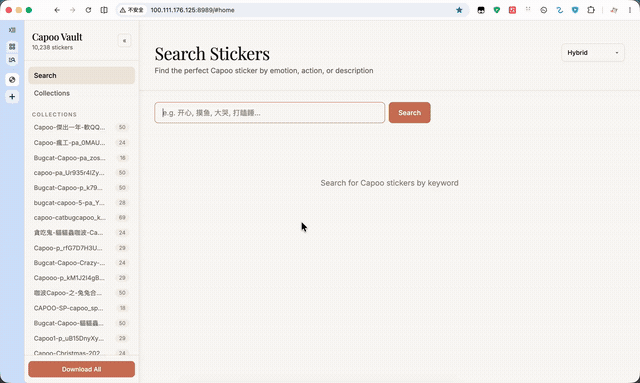

<div align="center">

# Capoo Vault

**简体中文** | [繁體中文](README.zh-TW.md) | [English](README.en.md)

</div>

<div align="center">

**10000+ 张 BugCat Capoo (貓貓蟲咖波) 贴纸语义标注，支持语义搜索。**

</div>

Capoo Vault 是一个 Capoo 贴纸语义标注数据集，包含 10238 张 GIF 贴纸的结构化标注（情绪、动作、场景、描述、标签），可用于聊天机器人、表情推荐、向量搜索等场景。

## 在线预览

可以先在这里预览贴纸合集与搜索体验：https://cst-cat.github.io/capoo-gallery/

预览站使用的是经过压缩的 GIF 资产，适合在线浏览和快速搜索；Docker/本地完整体验请下载 `gifs-vault` 素材包。

## 演示

### 搜索演示



### 合集浏览演示


## GIF 素材包下载

`gifs-vault` 素材包包含 Docker 和本地服务预览所需的 GIF 文件。可以从以下任一来源下载：

- [GitHub Releases](https://github.com/CST-Cat/capoo-vault/releases/tag/gifs-vault-20260629)
- [Google Drive 分流](https://drive.google.com/drive/folders/17jOZsG6EsqDpFCZP7jKukocQXndHG4Kx?usp=sharing)
- [夸克网盘分流](https://pan.quark.cn/s/83a6fbba44c6?pwd=xdU9)（提取码：`xdU9`）

下载后建议使用 release 中的 `capoo-vault-gifs-vault-20260629.sha256` 校验分卷文件完整性。解压后将 `gifs-vault` 文件夹放到项目根目录下。

## 数据规模

| 来源 | 数量 | 状态 |
|------|------|------|
| gifs_webp | 3982 | ✅ 100% |
| gifs | 5843 | ✅ 100% |
| gifs_tgs | 413 | ✅ 100% |
| **合计** | **10238** | **100%** |

## 标注格式

每张贴纸对应一个 JSON 文件：

```json
{
  "gif": "001-file_457.gif",
  "set": "013-CAPOO-SP-capoo_sp_animated",
  "emotion": "开心",
  "action": "挥手打招呼",
  "scene": "白色背景",
  "description": "咖波举起小爪子热情挥手打招呼",
  "tags": ["咖波", "打招呼", "挥手", "开心", "可爱", "问候", "蓝色猫", "表情包"]
}
```

| 字段 | 类型 | 说明 |
|------|------|------|
| `gif` | string | GIF 文件名 |
| `set` | string | 所属贴纸包名称 |
| `emotion` | string | 主要情绪 |
| `action` | string | 动作描述 |
| `scene` | string | 场景描述 |
| `description` | string | 15-25字中文描述 |
| `tags` | string[] | 5-8个中文标签 |

## 目录结构

```
capoo-vault/
├── README.md
├── Dockerfile
├── docker-compose.yml
├── .env.example          # 环境变量模板
├── requirements.txt
├── build_index.py        # 构建搜索索引
├── search_server.py      # 搜索服务（TF-IDF + Embedding）
├── gifs-vault/           # GIF 素材目录（Docker 运行时挂载，需下载/解压）
├── data/
│   ├── stickers.json     # 搜索元数据
│   └── tfidf_index.json  # TF-IDF 搜索索引
├── docs/
│   ├── spec.md           # 标注规范
│   ├── annotation_workflow.md  # 标注工作流
│   ├── annotation_summary.md   # 经验总结
│   └── capoo-all-sticker-links-combined.md  # 贴纸来源
└── annotations/
    ├── gifs/             # 10238 个标注 JSON
    └── batches.json
```

## 快速开始

### 1. Docker 部署（推荐）

```bash
# 下载 GIF 素材包后，放到 capoo-vault 项目根目录
# 从 GitHub Releases、Google Drive 或夸克网盘分流下载所有 capoo-vault-gifs-vault-YYYYMMDD.7z.00* 分卷文件
# 解压后应得到 ./gifs-vault/<贴纸包>/*.gif
7z x capoo-vault-gifs-vault-YYYYMMDD.7z.001

# 复制环境变量模板
cp .env.example .env

# 编辑 .env，填入你的 Embedding API Key
# 支持 OpenAI / Jina / 自定义兼容接口

# 构建并启动
docker compose up -d

# 访问 http://localhost:8989
```

Docker Compose 会把宿主机的 `./gifs-vault` 挂载到容器内的 `/app/gifs-vault`。
如果你手动调整路径，请同步设置 `VAULT_DIR`；默认容器配置为 `VAULT_DIR=/app/gifs-vault`。
注意不要解压成 `gifs-vault/gifs-vault/` 这种多一层目录。
Windows 用户可以用 7-Zip 打开 `.7z.001` 分卷，Linux 用户可以安装 `p7zip-full` 或 `7zip` 后运行上面的命令。

### 2. 本地运行

```bash
cp .env.example .env
# 编辑 .env 填入 API Key

pip install -r requirements.txt
python build_index.py     # 构建索引（需要 API Key）
python search_server.py   # 启动服务
```

本地运行时，默认会优先读取项目根目录下的 `gifs-vault/`。
如果 GIF 素材放在其他位置，可以通过 `VAULT_DIR=/path/to/gifs-vault python search_server.py` 指定。

### 3. 仅 TF-IDF（不需要 API Key）

```bash
pip install scikit-learn
python build_index.py     # 只构建 TF-IDF 索引
SEARCH_MODE=tfidf python search_server.py
```

## 目前缺点

- 部分 GIF 在浏览器预览时可能出现背景闪烁，通常与原始贴纸素材、透明背景处理或 GIF 优化过程有关。
- 数据集整合自多个贴纸包来源，部分表情包可能存在重复或近似重复。
- TF-IDF 是本地关键词匹配，适合明确短词，但对模糊语义、复杂情绪或同义表达不一定准确；部分贴纸标注也可能存在偏差。
- 如果搜索结果不理想，建议优先使用 Collections/合集浏览功能，按贴纸包直接翻找通常更稳定。

## 使用说明

- 常用贴纸建议直接 Download 下载到本地收藏，后续使用会更方便。
- Copy 适合静态表情包，会将图片作为 PNG 复制到剪贴板。
- 动态 GIF 建议使用 Download，浏览器通常不支持把 animated GIF 直接写入剪贴板。
- 如果这个项目对你有帮助，欢迎点一个 Star。

## 搜索模式

| 模式 | 说明 | 需要 API | 质量 |
|------|------|----------|------|
| `tfidf` | 字符 n-gram 关键词匹配 | ❌ | ⭐⭐⭐ |
| `embedding` | 语义向量搜索 | ✅ | ⭐⭐⭐⭐⭐ |
| `hybrid` | TF-IDF + Embedding 融合 | ✅ | ⭐⭐⭐⭐⭐ |

在 `.env` 中设置 `SEARCH_MODE=tfidf / embedding / hybrid`

当前三种搜索模式的实现方式：

- `tfidf`：纯本地字符 n-gram TF-IDF 关键词匹配，适合 `开心`、`摸鱼`、`崩溃` 这类明确短词。
- `embedding`：用 `Qwen/Qwen3-Embedding-0.6B` 生成查询向量，与本地 `data/embeddings.npy` 做 cosine similarity，返回语义相近的 Top 结果。
- `hybrid`：默认推荐模式，先分别召回 TF-IDF Top 500 和 Embedding Top 500，再按下面的本地 rerank 分数重新排序：

```text
final_score =
  0.55 * embedding_score
+ 0.30 * tfidf_score
+ 0.15 * field_match_score
```

`field_match_score` 会优先考虑 `emotion`、`action`、`tags`、`description`、`scene` 等字段是否命中查询词。默认搜索接口最多返回 Top 120，避免 embedding 模式返回过长的低相关结果。

Embedding 索引是预先把所有贴纸描述转换成向量后保存到 `data/embeddings.npy`。
运行搜索时不需要重新给全部贴纸建索引，只需要用同一个模型给用户查询生成向量。
如果更换 `OPENAI_EMBEDDING_MODEL`，需要重新运行 `python build_index.py` 生成新的 embedding 索引。

## 支持的 Embedding Provider

| Provider | 环境变量 | 免费额度 |
|----------|----------|----------|
| OpenAI | `OPENAI_API_KEY` | $5 新用户 |
| Jina AI | `JINA_API_KEY` | 100M tokens/月 |
| 自定义 | `OPENAI_BASE_URL` | 取决于提供商 |
| 本地模型 | `EMBEDDING_PROVIDER=local` | 无限（需 GPU） |

## 标注规范

详见 [spec.md](docs/spec.md)

标注工作流与经验总结见 [annotation_workflow.md](docs/annotation_workflow.md)、[annotation_summary.md](docs/annotation_summary.md)。

## 数据来源

贴纸来自 Telegram Stickers，通过 MiMo v2.5 批注。

- [MiMo](https://mimo.xiaomi.com/) — 小米 MiMo 视觉模型，本项目标注所用
<summary>📦 表情包来源（点击展开）</summary>

以下列出本项目收录的所有 Capoo 贴纸合集来源（355 个合集，354 个成功下载），包含 SigStick 网站链接和 Telegram 下载链接。

👉 完整列表见 [capoo-all-sticker-links-combined.md](docs/capoo-all-sticker-links-combined.md)

</details>

## 友情链接

- [Linux.do](https://linux.do/) — 开源社区，感谢社区支持与交流
- [MiMo](https://github.com/XiaoMi/MiMo) — 小米 MiMo 视觉模型，本项目标注所用

## License

MIT
